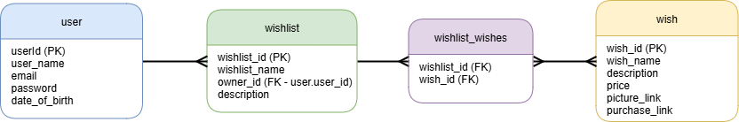
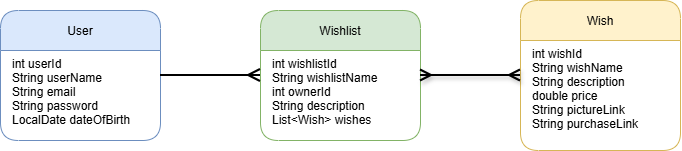

# Wishlist Application
> Udviklet af **Gruppe 3 - Frederik Ullersted, Sebastian Vijeyaratnam & Thor Gøtze**

 Dette projekt er en simpel **ønskeliste-app**, hvor brugere kan oprette sig, lave deres egne ønskelister og tilføje ønsker.
 Applikationen er bygget i **Java Spring Boot** med **Thymeleaf** som frontend og **MySQL** som database.

## ER Model

Diagrammet viser relationerne mellem brugere, ønskelister og ønsker.  
En bruger kan have mange ønskelister, og ønskelister kan indeholde mange ønsker.  
Relationen mellem `wishlist` og `wish` håndteres via en koblingstabel `wishlist_wishes`.

---
    
## Klassediagram

Klassediagrammet viser de vigtigste modelklasser (`User`, `Wishlist`, `Wish`) og deres attributter.
